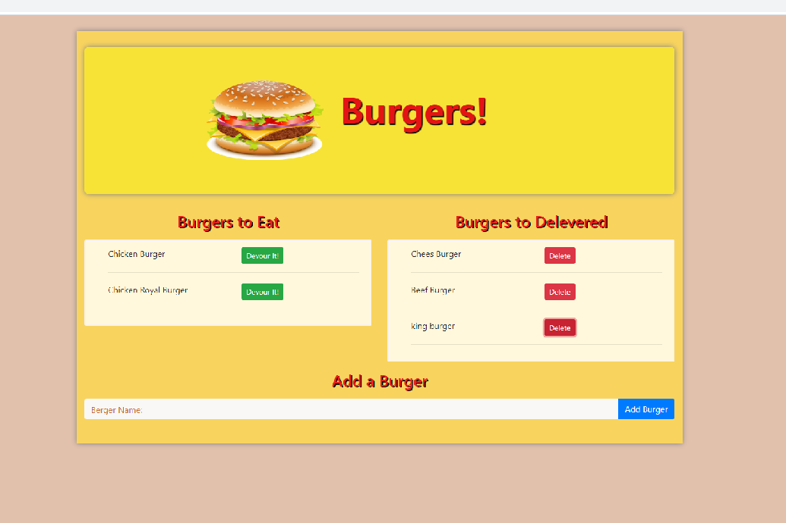

# Burger Logger App

* Eat-Da-Burger! is a restaurant app that lets users input the names of burgers they'd like to eat.

* Whenever a user submits a burger's name and app will display the burger on the left side of the page -- waiting to be devoured.

* Each burger in the waiting area also has a `Devour it!` button. When the user clicks it, the burger will move to the right side of the page.

* App will store every burger in a `database` name `burgers_db`, whether devoured or not.

    ##  Applications Uses in this projects
        
        For creating this app,followed the MVC design pattern and a homemade ORM and also 

            * Mysql
            * Node
            * Express
            * Handlebars
            * Bootstrap
            * HTML
            * MySQK to Query
            * Route data     

[GitHub Link](https://rumardas.github.io/burger/.)
[Heroku Link](https://enigmatic-shore-90584.herokuapp.com/ )

## Instalation 

        $npm init
        $ npm install, 
        $ npm install gitignore -g
        $ npm install express
        $ npm install express-handlebars
        $ npm install mysql

All the recommended files and directories from the steps above should look like the following structure:

```
.
├── config
│   ├── connection.js
│   └── orm.js
│ 
├── controllers
│   └── burgers_controller.js
│
├── db
│   ├── schema.sql
│   └── seeds.sql
│
├── models
│   └── burger.js
│ 
├── node_modules
│ 
├── package.json
│
├── public
│   └── assets
│       ├── css
│       │   └── burger_style.css
│       └── img
│           └── burger.png
│   
│
├── server.js
│
└── views
    ├── index.handlebars
    └── layouts
        └── main.handlebars
```
## page view

